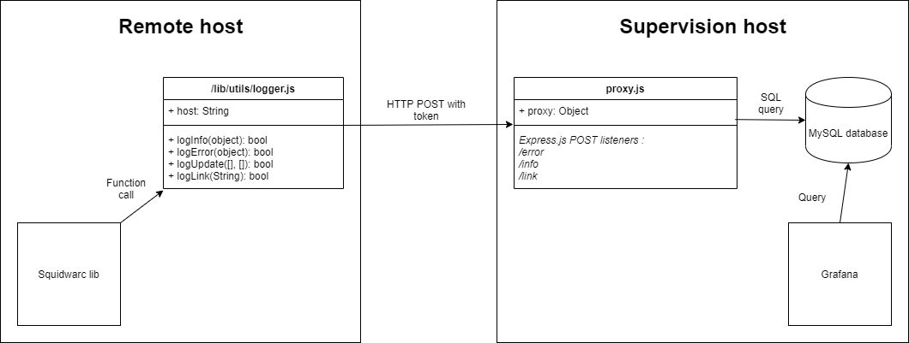

# squidwatch

The running Puppeteer instance sends API calls (helper class) to the monitor server (in NodeJS) on errors or events (URL discovered, URL process started, URL process stopped). 

The proxy store events details in a SQL database, which is used as source for a Grafana dashboard.

